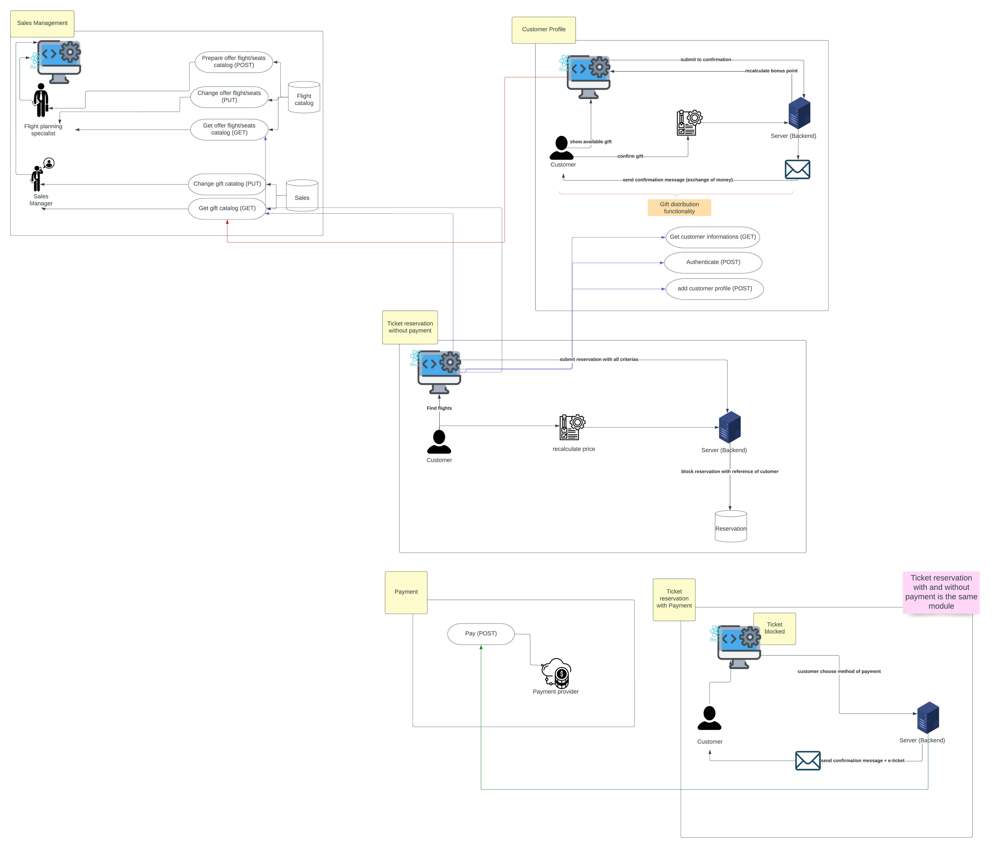

## Table of contents

- [Intro](#intro)
- [Domain description](#domain-description)
- [Domain exploration](#domain-exploration)
    - [Definition of Domain Storytelling](#definition-of-domain-storytelling)
    - [WPS Modeler: my preferred chosen tool](#wps-modeler-my-preferred-chosen-tool)
    - [important discovered bounded contexts](#important-discovered-bounded-contexts)
        - [Sales Management](#sales-management)
        - [Ticket reservation](#ticket-reservation)
        - [Ticket purchasing](#ticket-purchasing)
        - [Ticket rescheduling](#ticket-rescheduling)
- [Architecture](#architecture)
    - [Architectural Decision](#architectural-decision)
        - [Use modular monolith OR microservices](#use-modular-monolith-or-microservices)
        - [Use Ports and Adapters architecture](#use-ports-and-adapters-architecture)
        - [Use relational database as an aggregate data repository](#use-relational-database-as-an-aggregate-data-repository)
    - [Solution Architecture Microservices Diagram](#solution-architecture--microservices-diagram)

## Intro
Airline Reservation System(ARS) - software application that allows :
* making ticket reservations
* canceling and rescheduling tickets.

I tried to do the strategic DDD part by exploring the different subdomains/bounded contexts, scenarios etc before embarking on the architecture part.
I was inspired **_by an existing project_** for business rules and domain description.

## Domain description
The main purpose of the application is to support an airline customer with processes:
* checking availability
* making tickets reservations (blocking,reserving)
* cancelling tickets
* rescheduling reservations.

**Loyality program**

Using airline services involves granting the user bonus points. Each dollar spent adds up 10 bonus points.
The user can exchange the accumulated bonus points for the indicated discounts and privileges. They will be included in the next booking.

* If the user has 500 to 1000 points, he can use a more extensive menu.
* If the user has 1000 to 3000 points, he is entitled to take 1 piece of luggage.
* If the user has 3000 to 5000 points, he has the right to choose a place in business class (if available).

Each of the privileges can be exchanged for a cash discount (2% from the base ticket price for every 1000 points)

The gifts catalog is managed by the Sales Department.

**Checking availability**

The ticket reservation process begins with checking information on available flights. The customer sets his preferences (departure date/time,origin city
,arrival city, class,one-way or two-way trip, departure date, number and type (adult/senior/children) of passengers) and gives information about available
flights (the flight number,departure time in origin city,arrival time in destination city,the duration of the flight, the number of seats available on
that flight).

**Ticket reservation**

Via the online reservation system, the customer can reserve a maximum of 10 individual tickets per month. Before making the reservation, the system checks
whether the user has exceeded the limit .

It is necessary to provide flight number and seat number to reserve a seat.
If the difference between the departure date and system date is more than 2 weeks, the ticket is blocked without no cost.
Each customer can have only 3 blocked reservations at a time. Each subsequent ticket must be confirmed immediately.

Customer should make a make the final purchase of the ticket before 2 weeks of the departure date. 3 weeks before the date of departure, system should
send to the customer reminder message.

If the difference between today's date and departure date is less than 2 weeks, there is no possibility to block the ticket, it must be bought.

While the ticket is blocked, its price may change. After purchasing a ticket, its price cannot change.

After purchasing the ticket,the customer's credit card is charged. The customer receives a mail message with his confirmation number.

The number of bonus points will be increased.

**Ticket price calculation**

The initial price is set for the flight. It's the same for every seat on the plane. It has an auxiliary character and is not presented to the
client.The final  ticket price is calculated on the basis of many factors that increase or decrease the initial price.

**Calculations made on the reservation day:**
* if the reservation is made more than 4 months before the departure date, the initial price should be reduced by 60%
* if the reservation is made between 2-4 months before the departure date, the initial price should be reduced by 40%
* if the reservation is made two months before the departure date, the initial price should be reduced by 20%
* if the reservation takes place in the same month as the departure date the initial price should be increased by 10%

* if the departure date falls on Tuesday or Wednesday, the calculated price can be reduced by a further 20%

**Calculations performed on the confirmation day:**

* if 85% of seats have been sold for a given flight, the ticket price may be reduced by 10%
* if less than 85% of seats have been sold for a given flight, the ticket price must be increased by 10%

This type of discounts can be accumulated.

**Rescheduling ticket**

Ticket rescheduling based on confirmation number. It is possible only for confirmed tickets. Blocked ticket can't be rescheduled.
If there is any difference in the prices of the tickets, it is returned to the credit card account. New confirmation number is sent to the customer via email.
Changing the reservation date can be done only twice. After the limit has been used, the reservation must be canceled.

**Cancelling ticket**

Both blocked and confirmed tickets can be cancelled. To cancel the ticket it is required to provide the blocking id or confirmation id.  If the ticket has
been confirmed, cancellation will result in a reduction of 25% of the price.

If a canceled ticket has already been bought, the number of bonus points should be decreased.

**Check in**

The user can perform an automatic check-in. It is possible not earlier than 10 hours before the departure time .
This option is available in a Customer Profile. During the check-in process a boarding card is generated. After generating it is available from Customer
Profile.

**Customer Satisfaction Surveys**

After each flight, the user receives an e-mail with information that he can complete the survey satisfied and write a review.  This results in additional
bonus points (500 - survey, 1000 review). Flights to evaluate are presented in the user's profile.

**Special offers**

The Sales Department sends information about special offers prepared for customers. After entering the offer, it is published by email.

**Reporting system**

Reporting Department collects all activity events. They allow to recreate the entire activity history for each user.Each user can request to prepare such a
report.

## Domain exploration
##### Definition of Domain Storytelling

The main goal of domain storytelling in domain exploration is to help individuals and organizations better understand and communicate about a particular domain or subject area. It involves identifying key themes and concepts within the domain, and then using storytelling techniques to convey this information in a clear, engaging, and memorable way. Domain storytelling can be used for a variety of purposes, including educating others about a domain, building consensus around key issues, and inspiring action or change. By using stories to illustrate key points and convey meaning, domain storytelling can help people make sense of complex or technical information and better understand the significance of a domain or subject.

#### WPS Modeler: my preferred chosen tool

WPS Modeler is a software tool that can be used to create process models and diagrams, which can be useful in domain storytelling. To use WPS Modeler for domain storytelling, you would follow these steps:

1. Identify the key themes and concepts that you want to include in your domain story.

2. Use WPS Modeler to create a process model or diagram that illustrates these themes and concepts. This might involve creating a flowchart, network diagram, or other type of visual representation.

3. Use the process model or diagram to help tell your domain story. You might use it as a visual aid to help explain key points, or you might use it to show how different elements within the domain are connected or relate to one another.

4. Use storytelling techniques, such as using descriptive language, using examples, and using analogies, to make your domain story more engaging and memorable.

5. Test and refine your domain story to make sure it is clear and effective. You might do this by sharing your story with others and soliciting feedback, or by using it in a presentation or other setting and seeing how well it resonates with your audience.

website: <a href="https://www.wps.de/modeler/index.html"> wps modeler</a>
source files in files folder to play with all schema (In addition, I preferred this tool because you can import files and play all scenario step by step, this feature is very useful ;) ) You just import file in wps tool website.

##### Important discovered bounded contexts

###### Sales Management

The sales management bounded context is responsible for managing the sales process for air travel.
This includes tasks such as handling customer inquiries and booking requests, managing inventory and availability of flights. The bounded context may also include functionality for managing customer relationships, tracking sales performance and metrics, and generating reports and analytics related to sales activity.

<a href="https://github.com/trmalek/airlineReservationSystem/blob/main/img/airline-reservation-system%20scenario%20special%20offer%20plan%20elaborated%20by%20Sales%20management_2023-01-08.png" target="_blank">Show picture
</a>

<a href="https://github.com/trmalek/airlineReservationSystem/blob/main/img/airline-reservation-system%20scenario%20gift%20added%20by%20Sales%20management_2023-01-08.png" target="_blank">Show picture
</a>

###### Ticket reservation

<a href="https://github.com/trmalek/airlineReservationSystem/blob/main/img/Airline%20Reservation%20System%20scenario%20ticket%20reservation_2023-01-04.png" target="_blank">Show picture
</a>

###### Ticket purchasing
<a href="https://github.com/trmalek/airlineReservationSystem/blob/main/img/Airline%20Reservation%20System%20scenario%20ticket%20purchasing%20(with%20and%20without%20blocked%20ticket)_2023-01-04.png" target="_blank">Show picture
</a>

_2023-01-04.png)

###### Ticket rescheduling
<a href="https://github.com/trmalek/airlineReservationSystem/blob/main/img/airline-reservation-system%20scenario%20ticket%20rescheduling_2023-01-11.png" target="_blank">Show picture
</a>

## Architecture

### Architectural Decision

#### Use modular monolith OR microservices

It is generally recommended using a modular monolith architecture rather than microservices in certain situations because a monolith can be simpler to develop and maintain. A monolithic application is a single, self-contained software application that is built as a single unit, whereas a microservices architecture involves building a system as a collection of smaller, independent services that communicate with each other over an API.

There are several reasons why a modular monolith architecture might be preferred over microservices in some cases:

- Development simplicity: A monolithic architecture is typically easier to develop and test, because all the code is in one place and there are fewer moving parts to worry about. This can make it faster and cheaper to get an application up and running.

- Deployment simplicity: Deploying a monolithic application is generally easier than deploying a microservices system, because there is only one application to worry about rather than many small services.

- Easier to understand: Because a monolithic application is a single, cohesive unit, it can be easier for developers to understand and work with, especially if they are new to the codebase.

- Better performance: In some cases, a monolithic architecture can offer better performance than microservices, because there is less overhead involved in communication between services.

That being said, microservices can offer certain advantages over a monolithic architecture in certain situations.
For example:
- microservices can be more scalable and resilient, because individual services can be scaled up or down independently.
- They can also be more flexible, because services can be developed and deployed independently of each other.
- Ultimately, the choice between a monolithic architecture and microservices will depend on the specific needs and constraints of the system being developed.

<i> N.B: for our case, I even prefer to adapt the modular monolith to give me more time to find the boundaries 
of my bounded contexts and explore the different subdomains. But if a deep work has been done beforehand with
business experts, and we have a very clear vision of bounded contexts, I don't think there is a problem
in adapting the microservice's architecture as described in Vernon's book from the beginning.
</i>

#### Use Ports and Adapters architecture

Port and adapters architecture, also known as hexagonal architecture, is a design pattern that can be used to build software systems that are flexible, scalable, and easy to maintain. It is often recommended because it can help to decouple different parts of a system, making it easier to change or extend the system over time.

In a port and adapters architecture, the core business logic of the system is isolated in the center, or "core," of the system. This core is surrounded by a set of "ports," which represent the interface through which the core communicates with the outside world. These ports are connected to "adapters," which are responsible for translating the core's requests and responses into a form that can be understood by the external system or component.

There are several benefits to using a port and adapters architecture:

- Separation of concerns: By isolating the core business logic in the center of the system, the port and adapters architecture helps to separate different concerns within the system, making it easier to understand and maintain.

- Flexibility: Because the core business logic is decoupled from the external components of the system, it is easier to change or extend the system over time. For example, you can add or remove adapters without affecting the core.

- Testability: The port and adapters architecture makes it easier to test different parts of the system independently, because the core business logic is isolated from the external components.

- Reusability: Because the core business logic is decoupled from the external components of the system, it can be more easily reused in other contexts or applications.

Overall, the port and adapters architecture can help to create a more flexible, scalable, and maintainable software system.

#### Use relational database as an aggregate data repository

There are several reasons why a relational database might be used in the beginning of the design of a system, as opposed to a document database:

- Familiarity: Relational databases are a common choice for many developers because they are well-established and widely used. As a result, developers may be more familiar with the technologies and techniques involved in working with relational databases, which can make them a more comfortable choice.

- Data structure: Relational databases are well-suited for storing structured data that follows a defined schema. If the data being stored in the system is expected to have a well-defined structure, a relational database might be a good choice.

- Query capabilities: Relational databases are known for their powerful query capabilities, which allow developers to easily retrieve and manipulate data using SQL. This can be useful in the beginning stages of design when it is important to be able to quickly and easily test different queries and data manipulation techniques.

That being said, there are also situations where a document database might be a better choice. Document databases are often used when the data being stored has a more flexible, unstructured structure, or when the system requires fast inserts and updates. Additionally, document databases can be a good choice for systems that need to scale horizontally, because they are designed to be distributed across multiple servers. Ultimately, the choice between a relational database and a document database will depend on the specific needs and constraints of the system being designed.

### Solution Architecture Microservices Diagram

<a href="https://github.com/trmalek/airlineReservationSystem/blob/main/img/ars-microservices-diagram.jpeg" target="_blank">Show picture
</a>

#### diagram interpretation
What we did at domain story telling allowed us to know our boundaries well and gave us an idea of the scope of each module and each microservice.
As a result, I imagined a module dedicated to the sales management part to manage the catalog of flights and gifts, a module for the management of the customer profile. The idea of module here is that there are APIs to expose to other modules and the internal functionalities of each module that's why sometimes, we can see the backend server part well as well as a symbolic database to say that the module also manages its functionality from its context. A ticket booking module that needs several APIs from different modules to complete its task in the same module there are two big features blocking the booking without paying or paying the booking. For the frontend part, what I propose is to put the front part in a monolith (modular if you have a good command of boundaries) and suddenly each interface (reactJs for example) connects to APIs to complete its tasks.
There are a trade-offs concerning the customer profile module: the gift distribution part can be released in a separate microservice but that will force us to couple to the customer profile microservice and that's what I avoided since it concerns my understanding the customer so it will be wise to put it in the same module
